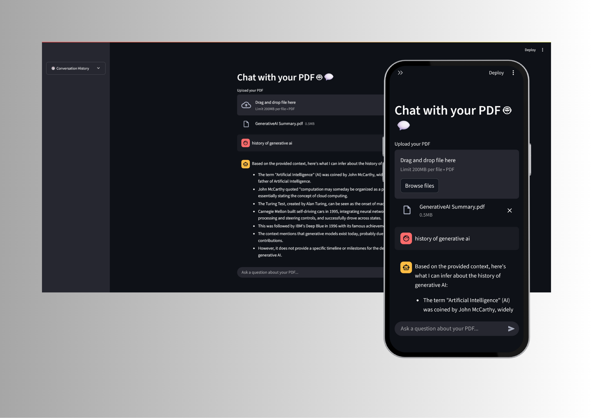

# 🤖 Chat with Your Data – Streamlit App

This is a Streamlit-based application that allows you to interact with the content of **PDF documents** using **natural language queries**. It leverages **LangChain**, **HuggingFace embeddings**, and **Groq-hosted LLaMA3** or **Mixtral** models to provide intelligent answers based on your uploaded PDF.

---

## 🖼️ Screenshots

### 📄 Upload PDF and Ask Questions  


---

## 🚀 Features

- 📄 Upload any PDF and extract its content.
- 🤖 Ask questions in natural language.
- 🧠 Uses `HuggingFaceEmbeddings` + `Chroma` vector store for semantic search.
- ⚡ Powered by **Groq-hosted** LLaMA3 or Mixtral for fast, high-quality LLM responses.
- 🗂️ Chat history accessible via a sidebar button for easy reference.
- 💬 Dynamic multi-message interface like ChatGPT (new input box appears after each question).


---

## 🧰 Tech Stack

- Python
- Streamlit
- LangChain
- HuggingFace Transformers
- ChromaDB
- Groq API (OpenAI-compatible LLM endpoint)

---

## 📦 Installation

1. **Clone this repository**:
   ```bash
   git clone https://github.com/your-username/chat-with-your-data.git
   cd chat-with-your-data

2. **Create and activate a virtual environment**:
    ```bash
    python -m venv venv
    source venv/bin/activate  # On Windows: venv\Scripts\activate

3. **Install dependencies:**:
    ```bash
    pip install -r requirements.txt

4. **Set up your .env file**:
Create a .env file in the root folder and add your Groq API key:
    `GROQ_API_KEY=your_groq_api_key_here`


5. **Run the Streamlit app**:
    ```bash
    streamlit run app.py
---

## 💡 Future Improvements

- Add support for CSV and TXT file types.
- Display source document snippets along with the answer.
- Add conversational memory for multi-turn interaction.
- Export Q&A history.
